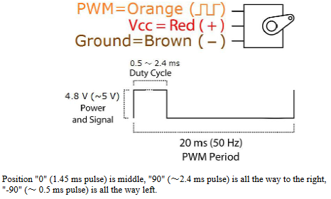
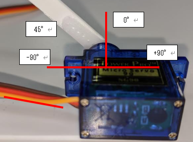

# SG90 制御概要
## 回転角度
- シグナル特性
  [秋月電子通商データシートからの抜粋](http://akizukidenshi.com/catalog/g/gM-08761/)  
    

- 実物  
　
  - 裏から見て CW 方向

- 角度の計算
  | -90° | 0° | +90° | 備考 |
  |:--:|:--:|:--:|:--:|
  | 0.5ms plus | 1.45 plus | 2.4 plus | データシートより |
  | 0.5 / 20 | 1.45 / 20 | 2.4 / 20 | 20ms PWM Period |
  | 2.5 | 7.25 | 12 | % |